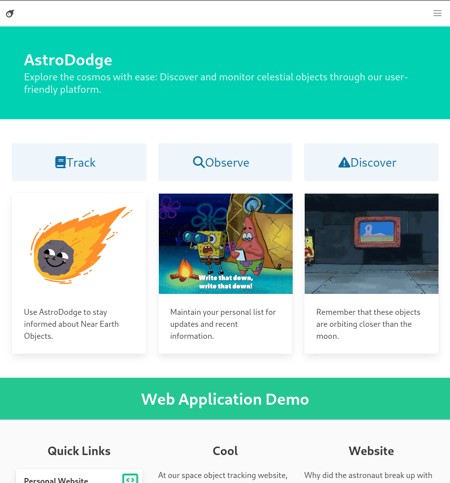

# Astro Dodge

Astro Dodge is a web application that tracks Near Earth Objects (NEOs) using NASA's Open APIs. It allows users to create an account, track specific objects on a watchlist, and and learn more details about a specific object.
## Description
<!-- 
Provide a short description explaining the what, why, and how of your project. Use the following questions as a guide:

- What was your motivation?
- Why did you build this project? (Note: the answer is not "Because it was a homework assignment.")
- What problem does it solve?
- What did you learn? -->


## Table of Contents (Optional)
<!-- If your README is long, add a table of contents to make it easy for users to find what they need.
 -->
- [Installation](#installation)
- [Usage](#usage)
- [Credits](#credits)
- [License](#license)

## Installation
<!-- What are the steps required to install your project? Provide a step-by-step description of how to get the development environment running. -->

### Docker Compose
1. Copy this repository and run the command: `docker compose up`  
2. This will build the images necessary to run this project.  

### Docker
A ready to use Docker image should be hosted in the GitHub Packages Container Registry.  
1. Simply pull the image from this repository with: `docker pull ghcr.io/kev-odin/astro-dodge:latest`  
2. Run the image with this command: `docker run astro-dodge:latest`  
3. Then open your web browser and enter `localhost:5000` in the address bar.

### Local Install
If you don't have Docker installed, you can follow these steps to install and run the Astro Dodge web application:

1. Clone the repository: `git clone https://github.com/kev-odin/astro-dodge.git`
2. Install dependencies using Poetry: `poetry install`
3. Start the development server: `poetry run flask run`

This will start the Astro Dodge web application and it will be accessible at http://localhost:5000/.

## Features
<!-- 
Provide instructions and examples for use. Include screenshots as needed.

To add a screenshot, create an `assets/images` folder in your repository and upload your screenshot to it. Then, using the relative filepath, add it to your README using the following syntax:

    ```md
    
    ```
 -->
 
### Mobile-Friendly Design

Astro Dodge is designed to be mobile-friendly, with responsive design that ensures the application looks great and functions well on any device.

### CI/CD with GitHub Actions

Astro Dodge uses GitHub Actions for Continuous Integration and Continuous Deployment. When code is pushed to the main branch, GitHub Actions automatically runs the tests and builds a Docker image that is stored in the GitHub Container Registry.

## Tech Stack


## How to Contribute
If you are intrested in contributing to this project, feel free to create an issue, fork the repository, and create a pull request. If new features are added, write relevant unit and integration tests to ensure code coverage.

## Tests
To run tests, you will need `poetry` installed. Learn more about the installation process .  
Run this command: `poetry run pytest`

## License
Astro Dodge is licensed under the [MIT License](https://github.com/username/astro-dodge/blob/main/LICENSE).